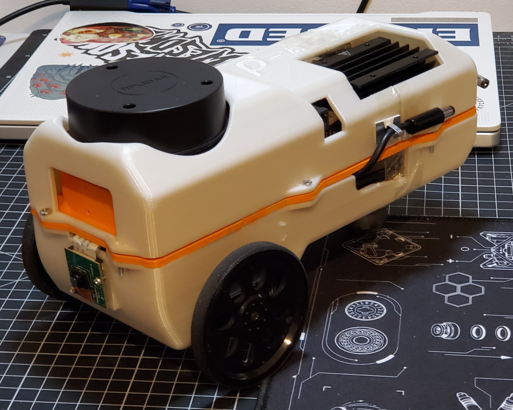
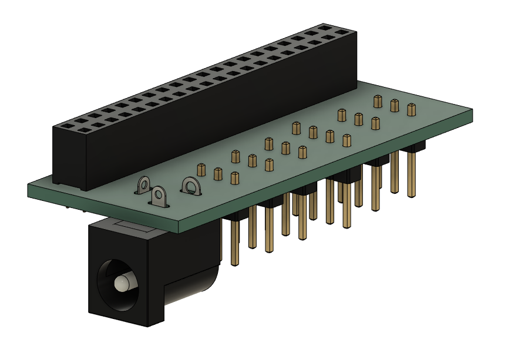
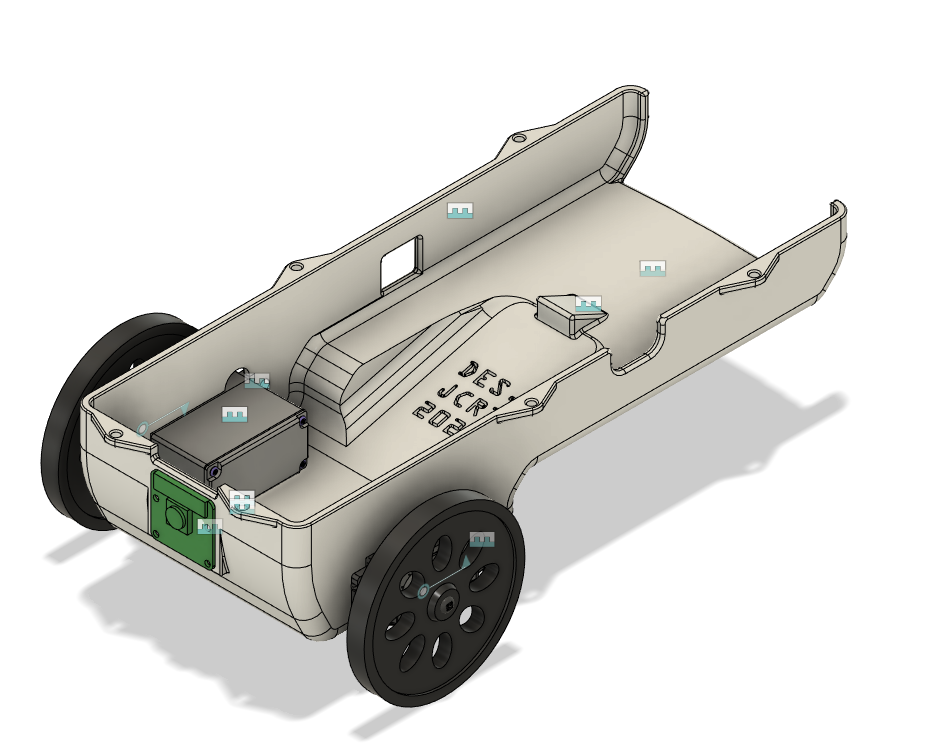
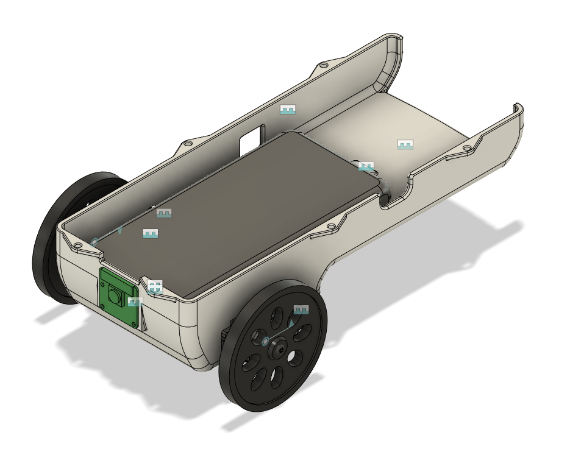
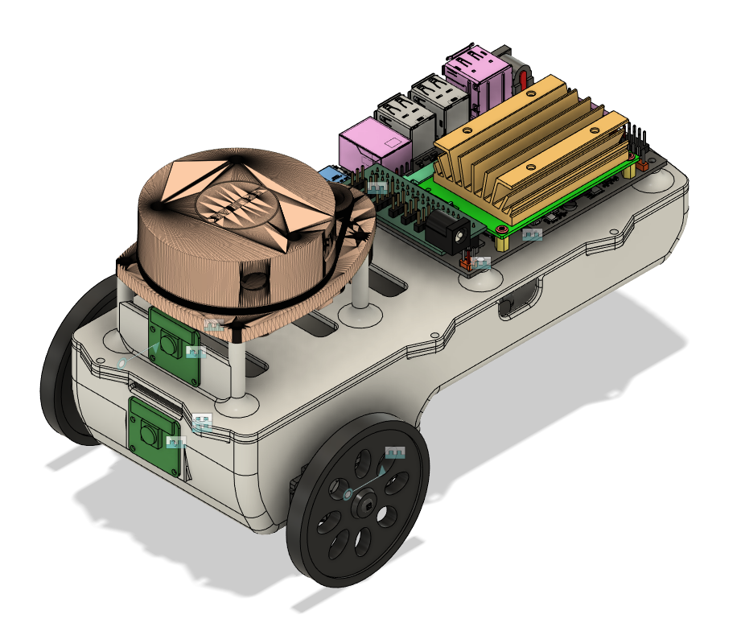
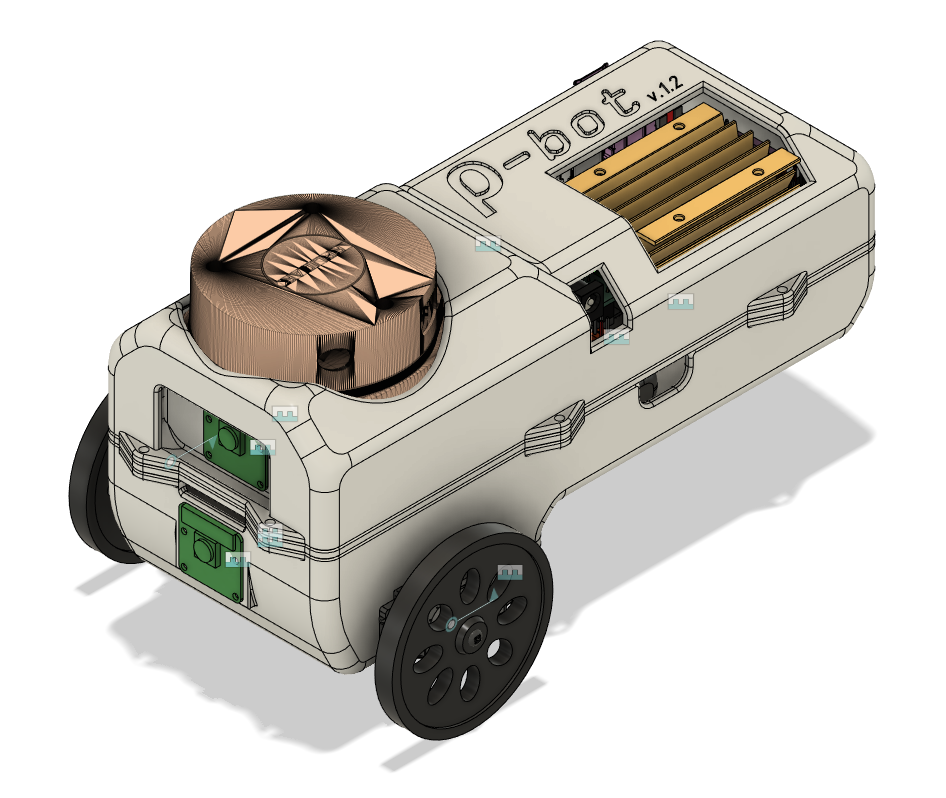

# RhoBot: A Robotics and AI platform

Rhobot is a mobile robot for research into obstacle avoidance built using an NVIDIA Jetson Nano, a Slamtec A1M8 RPLiDAR, a Raspberry Pi Cam v2, and two Parallax CR serco motors. The API provided in this repo provides an abstracted way to interface with the motors, however does not currently support interface with the LiDAR or camera so these would need to be implemented by a user.

## Table of contents

- Bill of Sale
- Enclosure and PCB Manufacture
- Build Guide and Set Up
- API Installation
- Sample Programs
- Credits

## Bill of Sale

| Part | Quantity | Cost (VAT included) | Where to buy |
| -------- | ------- | ------- | ------- |
| NVIDIA Jetson Nano | x1 | £167.94 | [RS Components](https://uk.rs-online.com/web/p/processor-development-tools/1999831?gb=s) |
| Parallax CR Servo Motor | x2 | £40.00 | [RS Components](https://uk.rs-online.com/web/p/servo-motors/7813046?gb=s) |
| Parallax Wheels | x2 | £6.40 | [Parallax](https://www.parallax.com/product/robot-wheel-molded-tire-for-servos/) |
| Ansmann Power Supply | x1 | £31.51 | [RS Components](https://uk.rs-online.com/web/p/power-banks/2498449?gb=s) |
| USB-A to DC Jack Cable | x2 | £12.84 | [RS Components](https://uk.rs-online.com/web/p/usb-cables/1862796?gb=s) |
| A1M8 LiDAR | x1 | £83.60 | [RobotShop](https://uk.robotshop.com/products/rplidar-a1m8-360-degree-laser-scanner-development-kit) |
| Raspberry Pi Camera v2 | x2 | £18.61 | [RS Components](https://uk.rs-online.com/web/p/raspberry-pi-cameras/9132664?gb=s) |
| USB Wifi Adapter | x1 | £12.00 | [RS Components](https://uk.rs-online.com/web/p/wifi-adapters/2558455?gb=s) |
| Total | ------- | £372.90 | ------- |

Necessary screws, nuts and bolts are not included in the bill of sale.

## Enclosure and PCB Manufacture

The enclosure is a three teir design and is fully 3D printable. In the CAD directory the their teirs are available in full and split to allow for printing on a smaller printer. The total print time is between 28 - 37 hours depending on material, and around £9 of filament. The weight is 0.3 kg.

If access to a 3D printer is not possible, the service [CraftCloud](craftcloud3d.com) have quoted £23.38 for the manufacture of the enclosure in PLA plastic.

The design files for the PCB were made using KiCAD and are available in the PCB directory. The service [PCBWay](pcbway.com) has quoted £4.01 for the manufacture of 10 boards.

## Build Guide and Set up

### Solder PCB
Firstly, sockets should be soldered onto the custom PCB. The 40 pin socket should be soldered to the bottom of the board and the remaining sockets should be mounted to the top of the board.

### Lowest Level
1) Screw the wheels onto the motors.
2) Use nuts and bolts to attach both motors to the "lower" enclosure component in the four mounting holes. Ensure the cables of the motors point towards the front of the enclosure so they will line up with the center of the LiDAR.
3) Use bolts screws to attach the camera to the mount on the "lower" component and route it's cable to the back of the enclosure.
4) Rest the power supply on top of the motors with the ports facing the back of the enclosure. Connect the USB-A to DC cables to the USB ports of the supply.

 

### Middle Level
1) Use bolts to secure the Jetson to the lower standoffs of the "middle" enclosure component.
2) Use boolts to secure the LiDAR sensor to the higher standoffs of the "middle" component.
3) Attach the PCB to the 40 pin GPIO header of the Jetson.
4) Route the motors and camera wire through the slots in the "middle" component. Attach the camera cable to the CSI port of the Jetson. Attach the motors to the PCB using the relevant sockets, noting the circuit schematic.
5) Connect the LiDAR UART and motor cables to the PCB noting the schematic.
6) Place the "middle" component over the "lower" component.

### Upper Level
1) Place the "upper" component onto the "middle" componet and secure the enclosure with the sixe bolt holes around the perimeter.
2) Attach the USB Wifi adapter to a USB port on the Jetson
3) Connect the power supply to the Jetson and PCB through using the USB to DC cables.

### Jetson Set Up
For detailed instructions how how to set up the Jetson, click this [link](https://developer.nvidia.com/embedded/learn/get-started-jetson-nano-devkit).

Once the Jetson boots, connect to a wireless network using the Linux network manager.

## API Installation

### Dependencies
Clone and build the [JetsonGPIO](https://github.com/pjueon/JetsonGPIO) repository. This will install the library used to interface with the Jetson's GPIO header.

For the camer and LiDAR, the [jetson-inference]()https://github.com/dusty-nv/jetson-inference and [rplidar-sdk](https://github.com/Slamtec/rplidar_sdk) are recommended respectively.

### Build Project
Clone this repository and run the following commands to build the project:

`mkdir build && cd build`

`cmake ..`

`make`

This will build the API library and compile the sample programs.

## Sample Programs

sample programs are provided to test the motor interface. To execute them run the relevant of the following commands while in the build directory:

`./test_motors`

`./test_differential_steering`

`./test_lidar`

## Credits

This project has been supervised by Dr. Bernd Porr and is a continuation of work done on the [AlphaBot](https://github.com/berndporr/alphabot) and [SigmaBot](https://github.com/berndporr/sigmabot) projects.

Rhobot is copyright ©️ of J.C. Redmond III and any use of the material in this repository should be appropriately credited.
